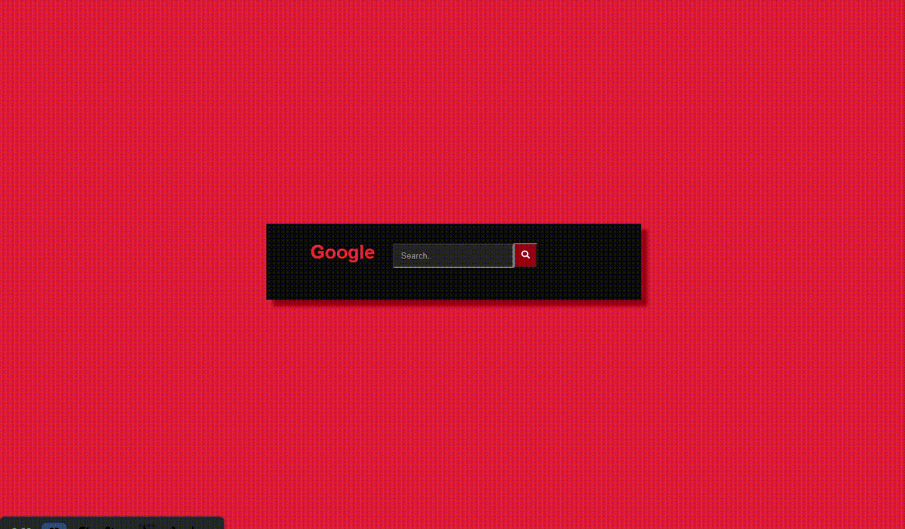

# Raspagem de dados-Google#
>extração do resultado do google usando a técnica de raspagem de dados(Web Scraping)



Porque escolhi o C# e ReactJS:

Por ser algo que trabalho boa parte do tempo e tenho uma facilidade maior, visando a questão do tempo que eu tinha de foco para produzir esses sistemas.

Qual a estratégia utilizada:

Para realizar o desafio, usei a técnica de coleta de dados, mais conhecida como Web Scraping, que consistem em coletar informações na internet de maneira automatizada a partir de bases de dados públicas disponibilizadas em sites e outros serviços online.

## Instalação só da aplicação:

### Requisitos
•	.NET 6 Runtime
Link: https://dotnet.microsoft.com/en-us/download/dotnet/6.0/runtime?cid=getdotnetcore

•	Navegador Atual da sua preferência.

### Executar a aplicação
Acessando a aplicação:
Extraía o zip "GoogleSearch" e execute o arquivo “GoogleSearch.exe”
Abra o navegador na url informada pelo cmd que foi aberto(Padrão: http://localhost:5000)

## Instalação e construir o código

### Requisitos
•	.NET 6 SDK 
Link: https://dotnet.microsoft.com/en-us/download/dotnet/thank-you/sdk-6.0.400-windows-x64-installer 

•	NodeJS LTS 
Link: https://nodejs.org/en/download/ 

•	Navegador Atual da sua preferência. 

### Executar a aplicação
Para inicializar a aplicação você deve na raiz do projeto GoogleSearch e execute o seguinte comando:
```bash
dotnet restore 
dotnet run
```
Abra o navegador na url informada pelo cmd que foi aberto(Padrão: http://localhost:5000)

